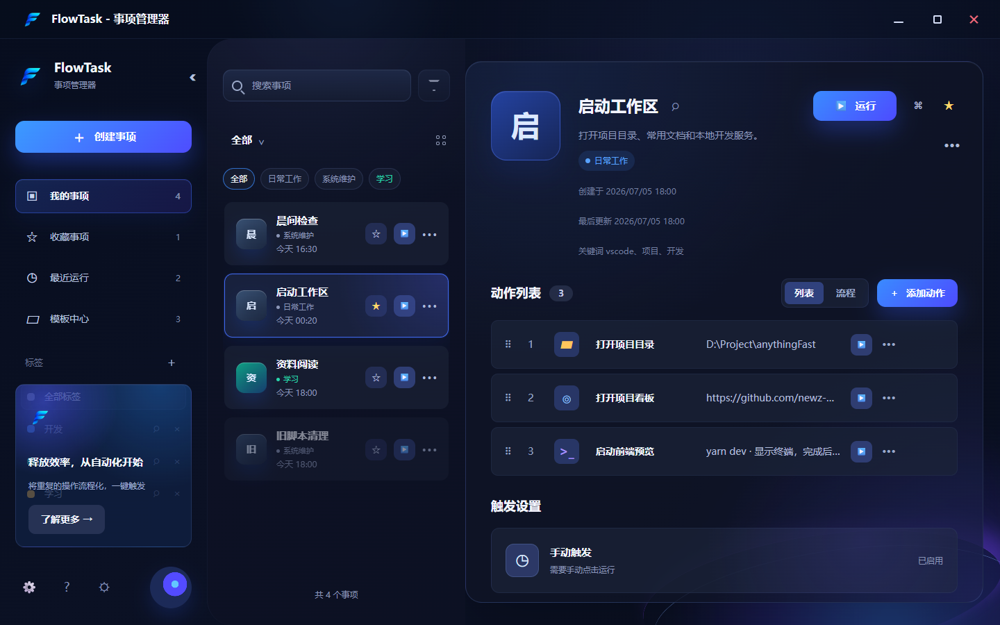
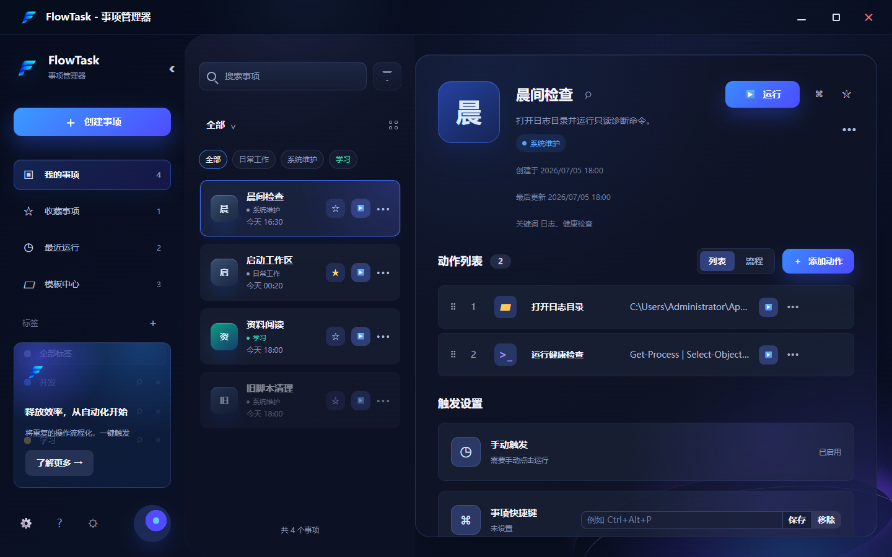
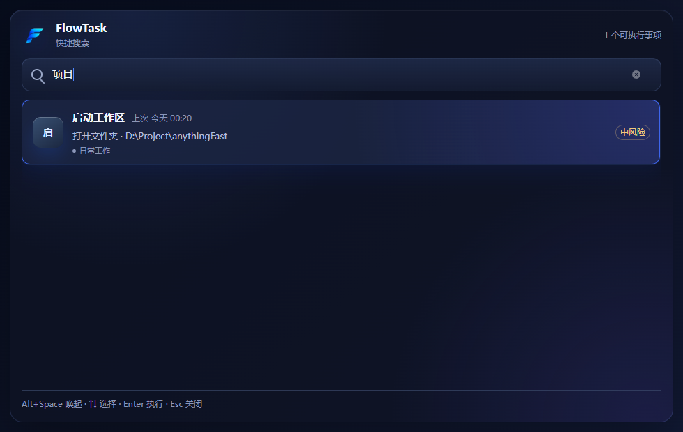

# 事项入口管理器

Windows 本地优先的事项入口管理器，用于把程序、URL、文件、文件夹、命令和延时等待组合成可搜索、可一键执行的“事项”。

项目当前是 MVP 骨架：主配置窗口用于管理事项和动作序列，快捷搜索面板用于快速搜索并执行事项。本地系统能力由 Tauri/Rust 后端统一处理，前端只负责交互、表单、搜索和反馈。

## 技术栈

- 桌面端：Tauri v2
- 后端：Rust
- 前端：Vue 3 + TypeScript + Vite
- UI：Naive UI
- 状态管理：Pinia
- 测试：Vitest、Rust unit tests
- 存储：本地 JSON 配置文件和本地执行摘要日志

## 功能概览

- 本地事项列表管理
- 事项分类、关键词和模糊搜索
- 快捷搜索面板
- 动作序列配置
- 支持打开程序、URL、文件、文件夹、执行命令、延时等待
- 按顺序执行动作
- 执行失败提示和摘要日志
- 高风险动作二次确认
- 本地 JSON 持久化配置

## 界面预览

主配置窗口：



事项详情：



快捷搜索面板：



## 快速开始

安装依赖：

```powershell
yarn
```

仅预览前端 UI：

```powershell
yarn dev
```

启动真实桌面应用：

```powershell
yarn tauri:dev
```

构建前端：

```powershell
yarn build
```

构建桌面应用：

```powershell
yarn tauri:build
```

## 验证命令

前端类型检查：

```powershell
yarn typecheck
```

前端测试：

```powershell
yarn test
```

Rust 测试：

```powershell
cd src-tauri
cargo test
```

Rust 编译检查：

```powershell
cd src-tauri
cargo check
```

## 项目结构

```text
src/
  api/                 Tauri invoke 和事件封装
  components/          Vue UI 组件
  composables/         前端业务组合逻辑
  domain/              前端搜索、风险、校验、工厂函数
  stores/              Pinia 状态
  styles/              全局样式
  types/               TypeScript 领域模型

src-tauri/
  src/commands.rs      Tauri commands
  src/domain.rs        Rust 领域模型
  src/executor.rs      动作执行器
  src/risk.rs          风险识别
  src/storage.rs       本地配置和日志存储
  src/validation.rs    后端校验
  tauri.conf.json      Tauri 窗口和构建配置
```

## 关键模块

- `src/types/domain.ts` 和 `src-tauri/src/domain.rs`：前后端领域模型，需要保持字段同步。
- `src/stores/taskStore.ts`：事项配置加载、保存、选择和设置。
- `src/stores/executionStore.ts`：执行状态、执行事件和日志。
- `src/components/layout/MainLayout.vue`：主配置窗口。
- `src/components/quick/QuickSearchPanel.vue`：快捷搜索面板。
- `src-tauri/src/commands.rs`：前端可调用的后端接口。
- `src-tauri/src/executor.rs`：本地动作执行。

## 开发注意事项

- `yarn dev` 只能预览前端，不能验证全局快捷键、本地文件打开、命令执行等 Tauri 能力。
- 系统动作必须通过 Rust/Tauri commands 执行，前端不要直接执行本地命令。
- 风险控制在前后端都有实现：前端用于即时反馈，后端用于保存和执行前强制校验。
- 高风险命令和首次执行命令事项必须二次确认。
- 命令动作的 stdout/stderr 仅在隐藏终端执行时写入执行日志；显示终端窗口时输出只显示在终端里，日志只保留退出码和执行结果。
- 本地配置写入应保持原子写入思路，避免产生空文件或损坏文件。
- `doc/`、构建产物、依赖目录、Tauri 生成目录和本地 AI 协作说明文件已在 `.gitignore` 中忽略。

## 默认约定

- 默认全局快捷键：`Alt+Space`
- 命令动作 shell：`powershell` 或 `cmd`
- 提交信息默认使用中文

## 开源协议

本项目使用 MIT License，详见 [LICENSE](./LICENSE)。
